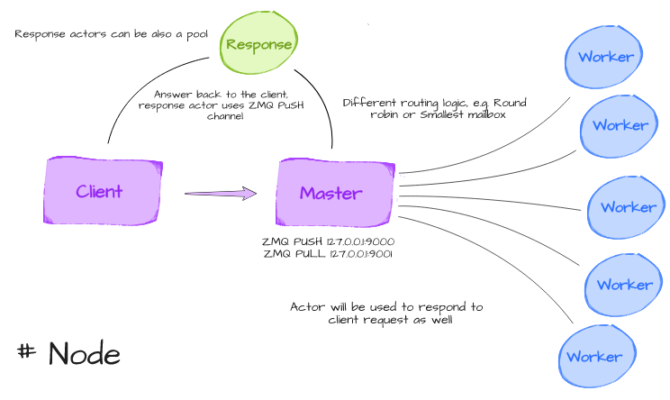

Tasq
====

Very simple distributed Task queue that allow the scheduling of job functions
to be executed on local or remote workers. Can be seen as a Proof of Concept
leveraging ZMQ sockets and cloudpickle serialization capabilities as well as a
very basic actor system to handle different loads of work from connecting
clients. Originally it was meant to be just a brokerless job queue, recently
I dove deeper on the topic and decided to add support for job persistence and
extensions for Redis/RabbitMQ middlewares as well.

The main advantage of using a brokerless task queue, beside latencies is the
lower level of complexity of the system. Additionally Tasq offer the
possibility of launching and forget some workers on a network and schedule jobs
to them without having them to know nothing about the code that they will run,
allowing to define tasks dinamically, without stopping the workers. Obviously
this approach open up more risks of malicious code to be injected to the
workers, currently the only security measure is to sign serialized data passed
to workers, but the entire system is meant to be used in a safe environment.

**NOTE:** The project is still in development stage and it's not advisable to
try it in production enviroments.


## Quickstart

Starting a worker on a node using Redis as backend

```
$ tq redis-worker --log-level DEBUG
2019-04-26 23:15:28 - tasq.remote.supervisor-17903: Worker type: Actor
```

In a python shell

**Using a queue object**

```
Python 3.7.3 (default, Apr 26 2019, 21:43:19)
Type 'copyright', 'credits' or 'license' for more information
IPython 7.4.0 -- An enhanced Interactive Python. Type '?' for help.
Warning: disable autoreload in ipython_config.py to improve performance.

In [1]: from tasq.queue import TasqQueue

In [2]: tq = TasqQueue(backend='redis://localhost:6379')

In [3]: def fib(n):
   ...:     if n == 0:
   ...:         return 0
   ...:     a, b = 0, 1
   ...:     for _ in range(n - 1):
   ...:         a, b = b, a + b
   ...:     return b
   ...:

In [4]: # Asynchronous execution
In [5]: fut = tq.put(fib, 50, name='fib-async')

In [6]: fut
Out[6]: <TasqFuture at 0x7f2851826518 state=finished returned JobResult>

In [7]: fut.unwrap()
Out[7]: 12586269025

In [8]: res = tq.put_blocking(fib, 50, name='fib-sync')

In [9]: res.unwrap()
Out[9]: 12586269025
```

Scheduling jobs after a delay
```

In [10]: fut = tc.schedule(fib, 5, name='fib-delayed', delay=5)

In [11]: fut
Out[11]: <TasqFuture at 0x7f2951856418 state=pending>

In [12]: # wait 5 seconds

In [13]: fut.unwrap()
Out[13]: 5

In [14] tq.results
Out[14] {'fib-async': <TasqFuture at 0x7f2851826518 state=finished returned JobResult>,
Out[14]  'fib-sync': <TasqFuture at 0x7f7d6e047268 state=finished returned JobResult>
Out[14]  'fib-delayed': <TasqFuture at 0x7f2951856418 state=finished returned JobResult>}
```

Scheduling a task to be executed continously in a defined interval

```
In [15] tq.put(fib, 5, name='8_seconds_interval_fib', eta='8s')

In [16] tq.put(fib, 5, name='2_hours_interval_fib', eta='2h')
```

Delayed and interval tasks are supported even in blocking scheduling manner.

Tasq also supports an optional static configuration file, in the
`tasq.settings.py` module is defined a configuration class with some default
fields. By setting the environment variable `TASQ_CONF` it is possible to
configure the location of the json configuration file on the filesystem.

By setting the `-c` flag it is possible to also set a location of a
configuration to follow on the filesystem

```
$ tq worker -c path/to/conf/conf.json
```

A worker can be started by specifying the type of sub worker we want:

```
$ tq rabbitmq-worker --worker-type process
```
Using `process` type subworker it is possible to use a distributed queue for
parallel execution, usefull when the majority of the jobs are CPU bound instead
of I/O bound (actors are preferable in that case).

If jobs are scheduled for execution on a disconnected client, or remote workers
are not up at the time of the scheduling, all jobs will be enqeued for later
execution. This means that there's no need to actually start workers before job
scheduling, at the first worker up all jobs will be sent and executed.

### Security

Currently tasq gives the option to send pickled functions using digital sign in
order to prevent manipulations of the sent payloads, being dependency-free it
uses `hmac` and `hashlib` to generate digests and to verify integrity of
payloads, planning to move to a better implementation probably using `pynacl`
or something similar.

## Behind the scenes

Essentially it is possible to start workers across the nodes of a network
without forming a cluster and every single node can host multiple workers by
setting differents ports for the communication.  Each worker, once started,
support multiple connections from clients and is ready to accept tasks.

Once a worker receive a job from a client, it demand its execution to dedicated
actor or process, usually selected from a pool according to a defined routing
strategy in the case of actor (e.g.  Round robin, Random routing or Smallest
mailbox which should give a trivial indication of the workload of each actor
and select the one with minimum pending tasks to execute) or using a simple
distributed queue across a pool of process in producer-consumer way.



Another (pool of) actor(s) is dedicated to answering the clients with the
result once it is ready, this way it is possible to make the worker listening
part unblocking and as fast as possible.

The reception of jobs from clients is handled by `ZMQ.PULL` socket while the
response transmission handled by `ResponseActor` is served by `ZMQ.PUSH`
socket, effectively forming a dual channel of communication, separating ingoing
from outgoing traffic.

## Installation

Being a didactical project it is not released on Pypi yet, just clone the
repository and install it locally or play with it using `python -i` or
`ipython`.

```
$ git clone https://github.com/codepr/tasq.git
$ cd tasq
$ pip install .
```

or, to skip cloning part

```
$ pip install git+https://github.com/codepr/tasq.git@master#egg=tasq
```

## Changelog

See the [CHANGES](CHANGES.md) file.

## TODO:

- [x] Possibility of a broker to persist jobs (classic task queue celery like)
- [x] Delayed tasks and scheduled cron tasks
- [x] Configuration handling throughout the code
- [x] Better explanation of the implementation and actors defined
- [x] Improve CLI options
- [ ] Check for pynacl for security on pickled data
- [ ] Tests
- [ ] Refactor of existing code and corner case handling (Still very basic implementation of even
      simple heuristics)
- [ ] Dockerfile
